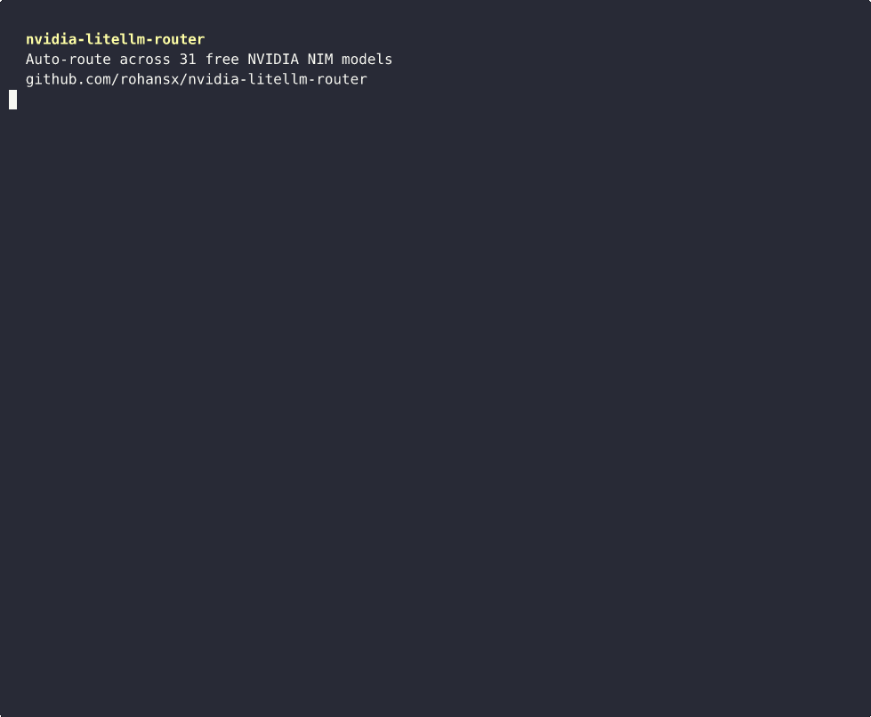

# nvidia-litellm-router

> Auto-route across **31 free NVIDIA NIM models** with latency-based routing, automatic failover, and smart tier-based model selection. Zero cost.

<p align="center">
  
</p>

## Why

NVIDIA NIM gives you **31 free LLM endpoints** — DeepSeek V3.2, Llama 4, Qwen 3.5, Kimi K2, and more. But each model has rate limits (~40 RPM), and you have to pick which one to call.

This router solves both problems:
- **Latency-based routing** picks the fastest model automatically
- **Failover** retries on 429s and routes to the next model
- **Tier routing** lets you target coding, reasoning, or fast models
- Combined with Groq + Cerebras, you get **~140 RPM free**

## Quick Start

```bash
# Clone
git clone https://github.com/rohansx/nvidia-litellm-router.git
cd nvidia-litellm-router

# Install
pip install -r requirements.txt

# Configure (get free key at https://build.nvidia.com/settings/api-keys)
cp .env.example .env
# Edit .env → add NVIDIA_API_KEY=nvapi-xxxx

# Generate config
python setup.py

# Start proxy
litellm --config config.yaml --port 4000

# Use it
curl http://localhost:4000/v1/chat/completions \
  -H "Authorization: Bearer sk-litellm-master" \
  -H "Content-Type: application/json" \
  -d '{"model": "nvidia-auto", "messages": [{"role": "user", "content": "hello"}]}'
```

## Model Groups

| Group | Models | Best for |
|-------|--------|----------|
| `nvidia-auto` | All 31 models | Default — fastest wins |
| `nvidia-coding` | Kimi K2, Qwen3 Coder 480B, Devstral 2 123B, Codestral, Qwen 2.5 Coder | Code gen, debugging |
| `nvidia-reasoning` | DeepSeek V3.2, Qwen 3.5 397B, Nemotron Ultra 253B, Llama 405B | Math, planning, hard problems |
| `nvidia-general` | Llama 4 Maverick/Scout, Mistral Large 2, DeepSeek V3.1, Mixtral | Balanced tasks |
| `nvidia-fast` | Phi 4 Mini, DeepSeek R1 distills, Mistral Small, Gemma 2 | Low latency, high throughput |
| `<model-name>` | Any model directly | e.g. `kimi-k2-instruct` |

<details>
<summary><strong>Full model list (31 models)</strong></summary>

### Reasoning (6)
| Model | ID |
|---|---|
| DeepSeek V3.2 | `deepseek-ai/deepseek-v3.2` |
| DeepSeek R1 Distill 32B | `deepseek-ai/deepseek-r1-distill-qwen-32b` |
| Nemotron Ultra 253B | `nvidia/llama-3.1-nemotron-ultra-253b-v1` |
| Llama 3.1 405B | `meta/llama-3.1-405b-instruct` |
| Qwen 3.5 397B | `qwen/qwen3.5-397b-a17b` |
| Qwen 3.5 122B | `qwen/qwen3.5-122b-a10b` |

### Coding (5)
| Model | ID |
|---|---|
| Kimi K2 | `moonshotai/kimi-k2-instruct` |
| Qwen3 Coder 480B | `qwen/qwen3-coder-480b-a35b-instruct` |
| Qwen 2.5 Coder 32B | `qwen/qwen2.5-coder-32b-instruct` |
| Devstral 2 123B | `mistralai/devstral-2-123b-instruct-2512` |
| Codestral 22B | `mistralai/codestral-22b-instruct-v0.1` |

### General (11)
| Model | ID |
|---|---|
| DeepSeek V3.1 | `deepseek-ai/deepseek-v3.1` |
| DeepSeek V3.1 Terminus | `deepseek-ai/deepseek-v3.1-terminus` |
| Nemotron Super 49B | `nvidia/llama-3.3-nemotron-super-49b-v1` |
| Llama 3.3 70B | `meta/llama-3.3-70b-instruct` |
| Llama 3.1 70B | `meta/llama-3.1-70b-instruct` |
| Llama 4 Maverick | `meta/llama-4-maverick-17b-128e-instruct` |
| Llama 4 Scout | `meta/llama-4-scout-17b-16e-instruct` |
| Qwen3 Next 80B | `qwen/qwen3-next-80b-a3b-instruct` |
| Mistral Large 2 | `mistralai/mistral-large-2-instruct` |
| Mixtral 8x22B | `mistralai/mixtral-8x22b-instruct-v0.1` |
| Mistral Medium 3 | `mistralai/mistral-medium-3-instruct` |

### Fast (9)
| Model | ID |
|---|---|
| Nemotron Nano 8B | `nvidia/llama-3.1-nemotron-nano-8b-v1` |
| Llama 3.1 8B | `meta/llama-3.1-8b-instruct` |
| Mistral Small 24B | `mistralai/mistral-small-24b-instruct` |
| Gemma 2 27B | `google/gemma-2-27b-it` |
| Phi 4 Mini | `microsoft/phi-4-mini-instruct` |
| Phi 4 Mini Flash | `microsoft/phi-4-mini-flash-reasoning` |
| DeepSeek R1 Distill 14B | `deepseek-ai/deepseek-r1-distill-qwen-14b` |
| DeepSeek R1 Distill 7B | `deepseek-ai/deepseek-r1-distill-qwen-7b` |
| DeepSeek R1 Distill Llama 8B | `deepseek-ai/deepseek-r1-distill-llama-8b` |

</details>

## How It Works

```
Your request (model: "nvidia-auto")
    │
    ▼
LiteLLM Proxy (localhost:4000)
    │
    ├── Measures latency of all 31 deployments
    ├── Picks the fastest healthy model
    ├── 429 / error? → retry 3x with backoff
    ├── Still failing? → failover to next model
    ├── Model slow? → deprioritized automatically
    ├── Model down? → 60s cooldown, auto-recovers
    │
    ▼
Response (model field shows which was picked)
```

### Fallback Chains

```
nvidia-coding    → nvidia-reasoning → nvidia-general
nvidia-reasoning → nvidia-general   → nvidia-coding
nvidia-general   → nvidia-fast      → nvidia-reasoning
nvidia-fast      → nvidia-general
```

## Usage Examples

### Python

```python
import openai

client = openai.OpenAI(
    base_url="http://localhost:4000",
    api_key="sk-litellm-master",
)

resp = client.chat.completions.create(
    model="nvidia-auto",  # or nvidia-coding, nvidia-reasoning, etc.
    messages=[{"role": "user", "content": "hello"}],
)
print(resp.choices[0].message.content)
print(f"Routed to: {resp.model}")
```

### TypeScript / Node.js

```typescript
import OpenAI from "openai";

const client = new OpenAI({
  baseURL: "http://localhost:4000",
  apiKey: "sk-litellm-master",
});

const resp = await client.chat.completions.create({
  model: "nvidia-coding",
  messages: [{ role: "user", content: "Write a quicksort in Python" }],
});
```

### Rust

```rust
let config = OpenAIConfig::new()
    .with_api_key("sk-litellm-master")
    .with_api_base("http://localhost:4000/v1");
let client = Client::with_config(config);

let request = CreateChatCompletionRequestArgs::default()
    .model("nvidia-auto")
    .messages(vec![...])
    .build()?;
```

See [`examples/`](examples/) for full working examples.

### curl

```bash
# Auto-route to fastest model
curl http://localhost:4000/v1/chat/completions \
  -H "Authorization: Bearer sk-litellm-master" \
  -H "Content-Type: application/json" \
  -d '{"model": "nvidia-auto", "messages": [{"role": "user", "content": "hello"}]}'

# Target coding models only
curl http://localhost:4000/v1/chat/completions \
  -H "Authorization: Bearer sk-litellm-master" \
  -H "Content-Type: application/json" \
  -d '{"model": "nvidia-coding", "messages": [{"role": "user", "content": "Write binary search in Go"}]}'
```

## Extra Free Providers

Add more API keys for even more throughput:

```env
# In .env
OPENCODE_API_KEY=xxx    # OpenCode Zen: Big Pickle, MiMo, MiniMax
GROQ_API_KEY=xxx        # Groq: Llama 70B, Mixtral (30 RPM)
CEREBRAS_API_KEY=xxx    # Cerebras: Llama 70B (ultra-fast)
```

Then `python setup.py` again — bonus models join the `nvidia-auto` pool.

| Provider | RPM | Models |
|----------|-----|--------|
| NVIDIA NIM | ~40 | 31 |
| OpenCode Zen | ~40/hr | 4 |
| Groq | 30 | 2 |
| Cerebras | 30 | 1 |
| **Combined** | **~140** | **38** |

## Docker

```bash
# Generate config first
python setup.py

# Run with official LiteLLM image
docker run -d \
  -p 4000:4000 \
  -e NVIDIA_API_KEY=nvapi-xxxx \
  -v $(pwd)/config.yaml:/app/config.yaml \
  ghcr.io/berriai/litellm:main-stable \
  --config /app/config.yaml
```

## Testing

```bash
# With proxy running:
python test_proxy.py
```

Tests all 5 tiers, reports latency and which model was selected.

## Configuration

| Variable | Required | Description |
|----------|----------|-------------|
| `NVIDIA_API_KEY` | Yes | Free at [build.nvidia.com](https://build.nvidia.com/settings/api-keys) |
| `OPENCODE_API_KEY` | No | OpenCode Zen free models |
| `GROQ_API_KEY` | No | Groq free tier |
| `CEREBRAS_API_KEY` | No | Cerebras free tier |
| `SLACK_WEBHOOK_URL` | No | Slack alerting for proxy errors |

## Project Structure

```
nvidia-litellm-router/
├── setup.py              # Config generator (run this first)
├── test_proxy.py         # Smoke tests
├── demo.sh               # Demo recording script
├── requirements.txt      # Python dependencies
├── .env.example          # Env var template
├── examples/
│   ├── python_usage.py
│   └── rust_usage.rs
└── docs/
    ├── architecture.md   # System design
    ├── tech-specs.md     # Technical specs
    ├── plan.md           # Implementation plan
    └── phases.md         # Phased rollout
```

## License

MIT
